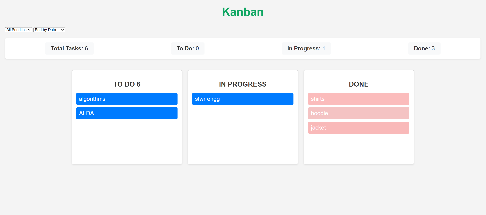

<p align="center">
  
</p>
<h2 align="center">The Only Todo List You Need</h2>

[](https://github.com/sumeetkhillare/To-Done/actions/workflows/django.yml)

[](https://coveralls.io/github/sumeetkhillare/To-Done?branch=main)
[](https://github.com/sumeetkhillare/To-Done/blob/main/LICENSE)
[](https://github.com/sumeetkhillare/To-Done/issues)
[](https://www.python.org/downloads/release/python-390/)
[](https://docs.djangoproject.com/en/4.2/releases/4.2/)
[](https://doi.org/10.5281/zenodo.14029341)
[](https://github.com/sumeetkhillare/To-Done/actions/workflows/autopep8.yml)
[](https://github.com/sumeetkhillare/To-Done/actions/workflows/pylint.yml)
[](https://github.com/sumeetkhillare/To-Done/actions/workflows/flake8.yml)

# TO-DONE 3.0

 Tired of wrestling with complex to-do lists? Say hello to To-Done! It is an innovative task management solution that
 increases your productivity by simplifying task organization. To-Done eliminates the hassle of old task management tools,
 allowing you to focus on what really matters - getting things done. Its web interface helps you to effortlessly manage your
 tasks anytime, anywhere. Whether you're organizing personal projects or collaborating with a team, To-Done provides a
 sorted environment that keeps you on track and in control. Experience the power of simplified productivity with To-Done 
where tasks get done, not delayed.

`to-done` lets you manage your todo list effectively with minimal effort. With a minimalistic web interface, 
you can access your todolist on the go. Use our rich library of templates to create a new todo list very fast or create your own.

# What's New in 3.0

- **Dynamic Task Management:** Edit tasks, deadlines, and priorities on-the-fly for maximum flexibility.

- **Editable Templates:** Save time with editable templates in new version and create to-do list using the same.

- **Multi-Modal Task Notes:** Capture task details through both text and voice notes for convenience.

- **Automated Deadline Reminders:** Stay on track with timely email notifications for approaching deadlines.

- **Enhanced User Interface:** Experience a streamlined, organized task management environment.

- **Optimized Database Performance:** Enjoy faster response times with improved database efficiency.

### Watch this video to know more about TO-DONE 3.0


<//add video>
[To-Done/docs_proj3](https://github.com/sumeetkhillare/To-Done/raw/main/docs_proj3/to-done-demo.mp4)

### Watch this video to know more about the original TO-DONE 


Contents
========

 * [Why?](#why)
 * [Features](#key-features-last-version)
 * [New Features](#new-features)
 * [Upcoming Features](#upcoming-features)
 * [Quick Start](#quick-start)
 * [Documentation](#Documentation)
 * [Want to contribute?](#want-to-contribute)
 * [License](#license)
 * [Developer](#developers-new-version)

### Why?

We wanted to work on something that is:

+ Useful, serves some real purpose
+ Easy to start with a basic working version and lends itself to adding new features incrementally to it
+ Easily divisible in modules/features/tasks that can be parallely done by five developers 
+ Diverse enough so that a lot of Software Engineering practices is required/involved 

`to-done` is a todo list app that is actually useful, very easy to create a basic working version with where a ton of new features can be added, touches upon all the aspects of web programming, database, working in a team etc.

### New Features
* [Email Notifications for tasks nearing deadline](#email-notification)
* [Voice Notes for Tasks](#voice-notes)
* [Edit Feature for Templates](#edit-template)
* [To-do tasks can be Modified](#modify-tasks)
* [Dockerized Application](#docker)
* [Stats on Kanban](#kanban-stats)

### Key Features (Last Version)
* [Register](#register)
* [Login](#login-forget-password)
* [Create, Delete Todo Lists](#manage-todo-list)
* [Quickly Create Todo Lists From Existing Templates](#templates)
* [Create Your Own Templates](#templates)
* [Shared List](#shared-todo-lists)
* [Add Due Date To Tasks](#due-date-color-tags)
* [Due Date Alerting Mechanism](#due-date-color-tags)
* [Add Reminder Message to task completed](#due-date-color-tags)
* [Customized Color Tag](#due-date-color-tags)
* [Add Tags To Todo Lists For Customizable Grouping](#customizable-grouping-tags)
* [Google Oauth sign in](#google-oauth-signin)
* [Kanban-board](#kanban-board)


### Upcoming Features
 * Social login
 * Export and import to-do lists
 * Gamification - earn points by finishing your tasks, show-off your productivity in social media
 * [List of All Planned Features for Second Phase](https://github.com/sumeetkhillare/To-Done/issues)

### Quick Start

 * [Download](https://www.python.org/downloads/release/python-390/) and install Python 3.9.0 or higher
 * [Install](https://docs.djangoproject.com/en/4.2/topics/install/) Django 4.2
 * Clone the repository
    ```bash
    $ git clone git@github.com:se-zeus/To-Done.git
    ```
* Change directory
    ```bash
    $ cd To-Done
    ```
* Install necessary libraries
    ```bash
    $ pip install -r requirements2.txt
    ```
 * Run migrations
    ```bash
    $ python manage.py makemigrations
    ```
* Migrate the DB
    ```bash
    $ python manage.py migrate
    ```
 * Start the app
    ```bash
    $ python manage.py runserver 8080
    ```
 * Point your browser at http://localhost:8080 and explore the app

### Documentation
[See this page](Documentation.md)

### NEW Features

#### Email Notification
<p float="middle">
    
</p>

#### Voice Notes
<p float="middle">
    
</p>

#### Edit Template
<p float="middle">
    
</p>

#### Modify Tasks
<p float="middle">
    
</p>

#### Kanban Stats
<p float="middle">
    
</p>

### Features

#### Register
<p float="middle">
    
</p>

#### Login, Forget Password
<p float="middle">
     
</p>

#### Manage Todo List
<p float="middle">
    
    <br>
    <br>
    
</p>

#### Templates
<p float="middle">
    
</p>

### New Features
#### Customizable Grouping Tags
<p float="middle">
    
</p>

#### Shared ToDo Lists
<p float="middle">
    
</p>

#### Due Date, Color Tags
<p float="middle">
    
</p>

#### Google Oauth signin
<p float="middle">
    
</p>

#### Kanban board
<p float="middle">
    
</p>


### Want to Contribute?

Want to contribute to this project? Learn about [Contributing](CONTRIBUTING.md). Not sure where to start? Have a look at 
the [good first issue](https://github.com/shahleon/smart-todo/issues?q=is%3Aissue+is%3Aopen+label%3A%22good+first+issue%22). Found a bug or have a new feature idea? Please create an [Issue](https://github.com/se-zeus/To-Done/issues) to notify us.

### License

Distributed under the MIT License. See [LICENSE](LICENSE) for more information.

### Developers (New Version)

1) Shashank Ajit Walke
2) Sumeet Bapurao Khillare
3) Xiaoqin Pi

### Developers (Last Version)

<table>
  <tr>
    <td align="center"><a href="https://github.com/m11dedhia"><br /><sub><b>Megh Dedhia</b></sub></a></td>
    <td align="center"><a href="https://github.com/Anjan50"><br /><sub><b>Anjan Diyora</b></sub></a><br /></td>
    <td align="center"><a href="https://github.com/SiriPaidipalli"><br /><sub><b>Siri Paidipalli</b></sub></a><br /></td>
  </tr>
</table>
